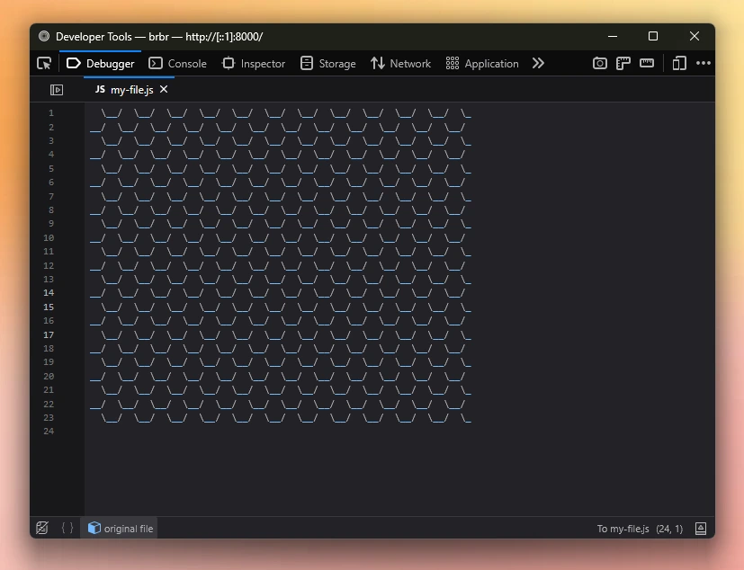

# fake-source-map 
Generates fake source maps for real javascript code



## Installation
Get it straight from NPM:
```shell
npm i fake-source-map
```

## Building from Source
Build it yourself:
```shell
$ git clone https://github.com/altwine/fake-source-map.git
$ cd fake-source-map
$ npm install
$ npm run format
$ npm run test
$ npm run build
```

## API Usage
### Basic Example
```ts
import { FakeSourceMapGenerator } from 'fake-source-map';
import path from 'node:path';

const file = './my-real-code.js';
const fakeCode = '\n   (its over...)\n (-_-)\n';

const filename = path.basename(file);
const fsmg = new FakeSourceMapGenerator({ filename });
fsmg.fromFile(file, fakeCode);
fsmg.appendToFile(file);
```

# License
MIT. Check [LICENSE](LICENSE) file.
